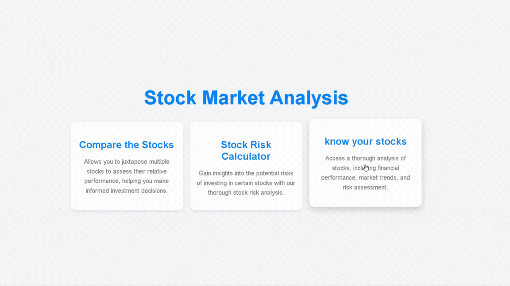

# 📈 Stock Analysis Web Application

This project is a stock analysis web application that allows users to fetch real-time stock data, analyze it, and visualize stock trends. The frontend is built with HTML and CSS, while the backend is powered by Python using the Flask framework. The backend utilizes various libraries like `numpy`, `pandas`, `matplotlib`, and `yfinance` to handle data processing and visualization.

## Features ✨

- **Visualizing Stocks**: Generate interactive plots and charts to visualize stock price movements and trends. 📊
- **Comparing Stocks**: Compare multiple stocks side by side to evaluate their performance using visual representations. 🔍
- **Stock Risk Calculator**: Assess the risk associated with different stocks based on historical data. ⚖️
- **Complete Stock Data Analysis**: Perform comprehensive analysis of stock data using various graphs and images. 📉

## Technologies Used 🛠️

### Frontend:
- **HTML5**: For structuring the web pages.
- **CSS3**: For styling and layout of the web pages.

### Backend:
- **Python**: Core programming language for data analysis and backend processing.
- **Flask**: Micro web framework for handling backend routing and requests.
- **Numpy**: For numerical computations.
- **Pandas**: For data manipulation and analysis.
- **Matplotlib**: For creating charts and visualizations.
- **yfinance**: For fetching real-time stock market data.
## Product Showcase

